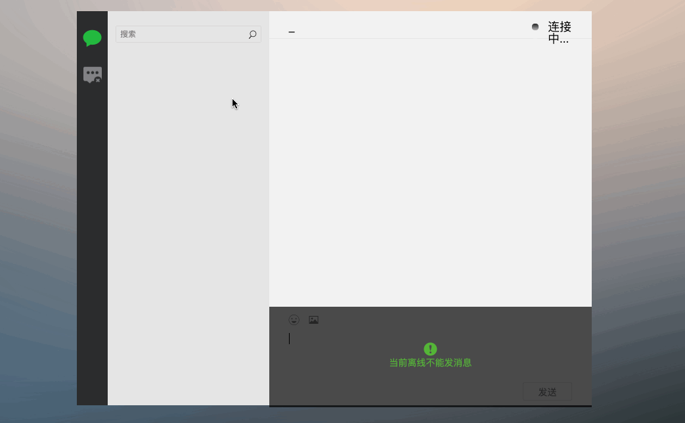

# 基于 Vue + ElementUI 的微信客服前端项目

本项目主要为接入微信公众号，让客服与客户通过公众号直接对话而开发并开源的

# 效果图

[在线体验](http://demo.xiaoguan.win/#/chat)

# 项目亮点

1. 界面高仿微信网页版
2. 支持发送文本（**包含部分表情**）和图片类消息
3. 支持接收微信支持的**所有格式的消息类型**和聊天有关的事件（如关注、取关、点击菜单等）
4. 开启 Mock 后**可完全脱离后端完成所有功能的[交互体验](http://demo.xiaoguan.win/#/chat)**

# 技术栈

- Vue 框架
- Vuex
- Vue-router
- ElementUI
- Stompjs
- Sockjs
- Mockjs

# 代码规范

## 命名规则

1. .vue 文件名 **大写驼峰**
2. .js 文件名 **小写横杠**

## 异步请求

1. 异步请求一律使用 Promise 风格
2. 所有与后端交互的 api 都放在 `src/api` 目录中，
3. 所有 url 放于 `api-path.js` 文件，并做好分类
4. 每一类型的 api 有单独的 js 文件，每一个 url 对应一个方法，用于**封装**发送请求并处理结果的逻辑
5. api 中调用`HttpUtil`定义的方法发起请求
6. 需要发送请求的地方**直接调用 api 的方法获取结果**

## Mock

1. mock 相关的文件全部放在 `mock` 目录下
2. 每个 xxx-api.js 文件对应一个 `xxx-api-mock.js`
3. **每个请求都要有相应的 Mock 拦截并返回数据**

## 通用组件

与**业务无关的通用组件**放在 `components/common` 目录下

## 启动

1. 首次运行先执行 `npm install`
2. `npm run dev`
3. 浏览器打开 http://127.0.0.1:8080

# 参考

本项目部分样式及表情基于 [Vue-chat](https://github.com/han960619/Vue-chat) 项目改造而来，该项目仿微信页面做得非常细致。

# Buy me a coffee

    </img>
    </img>

